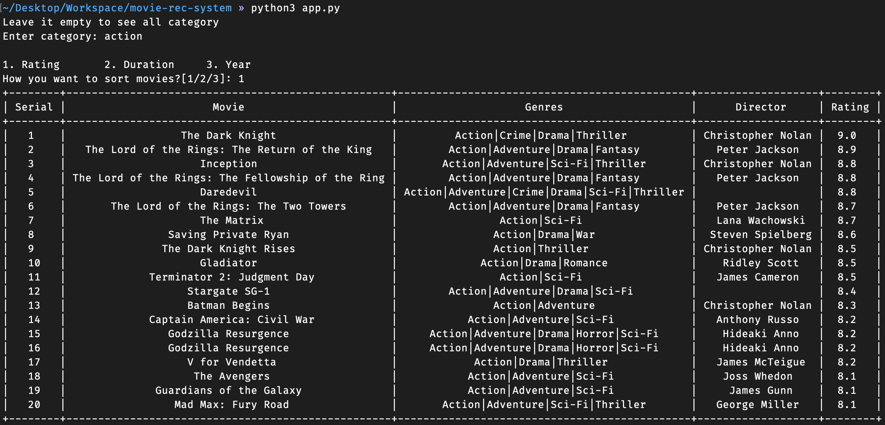
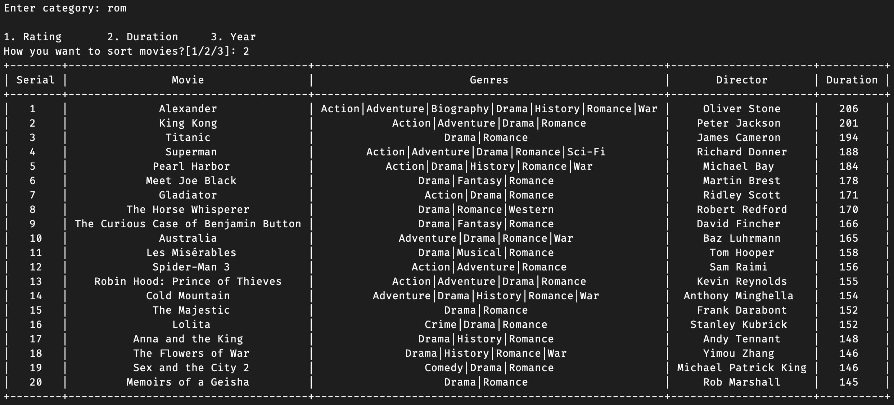
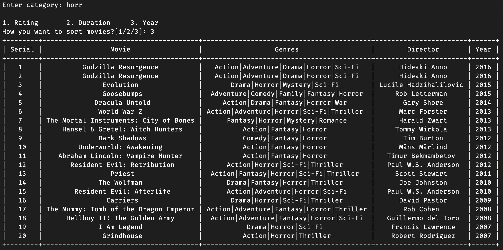

# Movie Recommendation System

## Features
* Using IMDB dataset, user can sort movie by rating, duration, year as their chosen genre

## Running The System
### Mac & Linux
1. Open Terminal
2. Run 
   ```shell script
   /bin/bash -c "$(curl -fsSL https://raw.githubusercontent.com/Homebrew/install/master/install.sh)"
   brew install python3
   brew upgrade python3
   brew install git
   git clone https://github.com/lifeoflikhon/movie-rec-system.git
   cd movie-rec-system
   python3 app.py
   ```
You are good to go.

### Windows
1. Follow [this](https://installpython3.com/windows/) steps
2. Install Git from [here](https://git-scm.com/download/win).
3. Open ```cmd prompt```
4. Run
   ```shell script
   git clone https://github.com/lifeoflikhon/movie-rec-system.git
   cd movie-rec-system
   python3 app.py
   ```
If you have done everything right, you are good to go.

## Screenshot






<p style="text-align: center;">Made with :heart: by @lifeoflikhon</p>